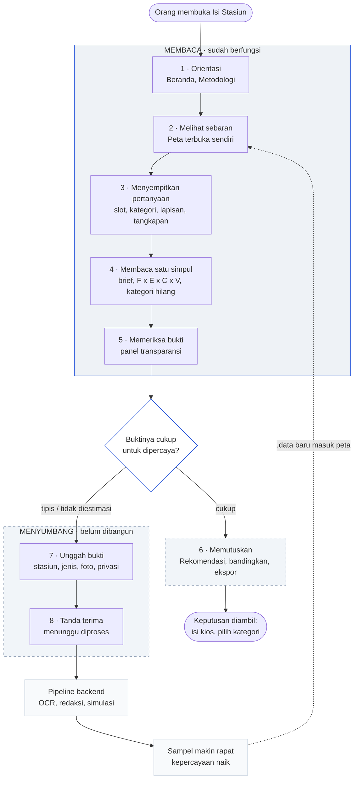
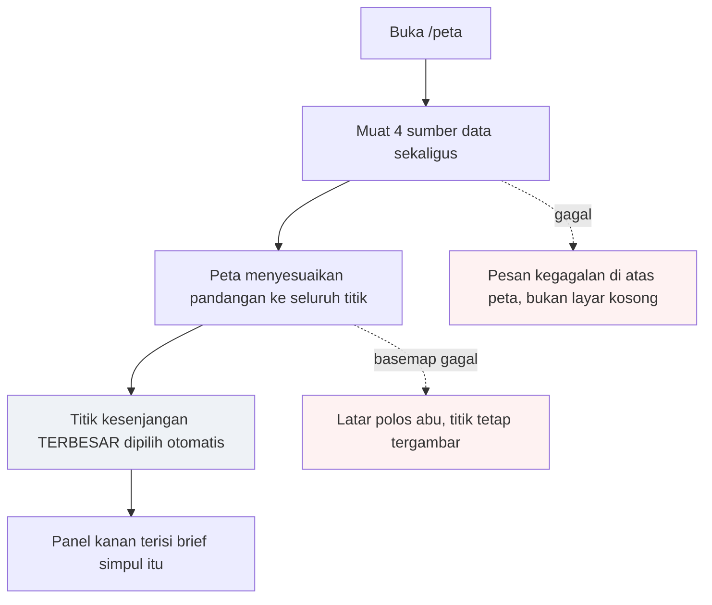
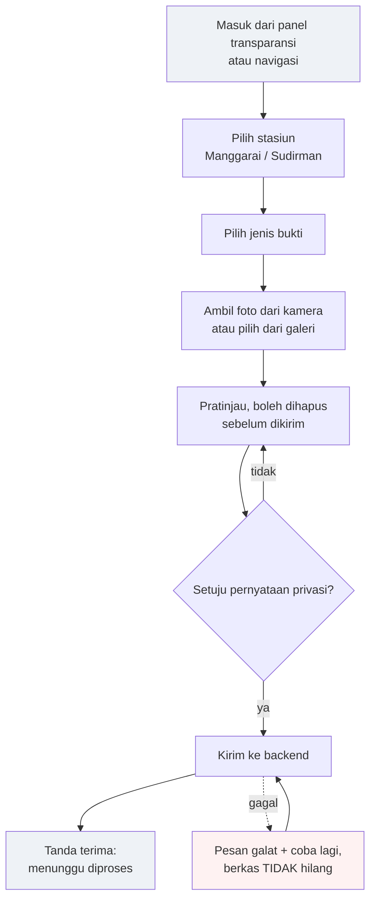
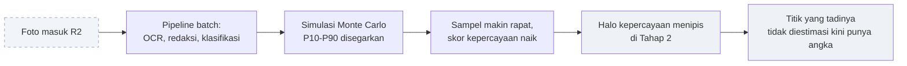
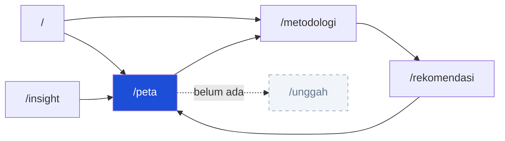

# Alur Pengguna — Isi Stasiun

> [!abstract] Posisi dokumen ini
> [[ROADMAP]] menjawab **apa yang dikerjakan dan dalam urutan apa**. [[DATA_CONTRACT]] menjawab **bentuk datanya seperti apa**. Dokumen ini menjawab yang berbeda dari keduanya: **apa yang sebenarnya terjadi ketika seseorang membuka aplikasi ini dan mulai menekan sesuatu.**
>
> Isinya bukan rencana. Yang ditulis adalah keadaan layar **hari ini** — termasuk tombol yang terlihat menjanjikan tapi sengaja tidak melakukan apa pun.

> [!important] Satu alur, bukan dua
> Membaca analitik dan mengunggah bukti **bukan dua fitur terpisah**. Keduanya satu lingkaran: orang membaca angka → sampai pada titik yang buktinya tipis → menyumbang foto → pipeline mengolahnya → sampel makin rapat → angka yang dibaca berikutnya lebih bisa dipercaya.
>
> Dokumen ini disusun mengikuti lingkaran itu — **delapan tahap berurutan**, tersedia dalam tiga bentuk: diagram (§2), **daftar langkah dalam kalimat (§2)**, dan rincian per tahap (§3). Daftar per rute ada di §7 untuk keperluan teknis, tapi itu lampiran, bukan kerangkanya.

> [!warning] Dua realita yang belum bertemu
> Sejak [[00-GROUND-TRUTH-MASTER]] ditetapkan, scope studi resmi adalah **2 stasiun** (Manggarai & Sudirman). Namun data contoh dan empat halaman statis di kode **masih menampilkan 3 stasiun** ("Stasiun A/B/C", "tiga simpul, tiga tipe kawasan").
>
> Dokumen ini menulis **apa yang benar-benar muncul di layar**, bukan apa yang seharusnya. Setiap tempat yang terkena selisih ini ditandai ⚠️.

---

## 1. Cara membaca dokumen ini

| Tanda | Arti |
|---|---|
| ✅ | **Berfungsi** — menekan ini benar-benar mengubah sesuatu di layar |
| 🟡 | **Sengaja mati** — terlihat dan bergaya, tetapi tidak melakukan apa pun. Bukan bug: semuanya janji proposal yang menunggu backend atau keputusan tim |
| ⛔ | **Belum ada** — layar atau alurnya belum dibangun sama sekali |
| ⚠️ | **Perlu keputusan** — ada selisih antara kode, dokumen, dan realita |

> [!info] Kenapa yang mati tetap ditulis
> Tombol seperti "Bandingkan", "Tabel atribut", dan "Unduh brief" bukan hiasan — semuanya dijanjikan proposal (§3.2) dan tercatat di [[ROADMAP]] Fase 3. Menghapusnya dari dokumen alur berarti menghapusnya dari ingatan tim. Menyalakannya diam-diam tanpa backend berarti berbohong ke juri. Jadi keduanya ditolak: ditulis, ditandai, ditunggu.

---

## 2. Alur lengkap

### Alur yang sama, dalam kalimat

> [!info] Cara membaca daftar ini
> Satu perjalanan utuh dari membuka aplikasi sampai lingkarannya menutup. Langkah **tanpa tanda sudah berfungsi hari ini**; 🟡 = ada di layar tapi sengaja mati; ⛔ = belum dibangun sama sekali. Rinciannya per tahap ada di §3.

**Tahap 1 · Orientasi**

1. Pengguna membuka Isi Stasiun dan mendarat di halaman **Beranda**.
2. Pengguna membaca pengantar masalahnya: ada potensi belanja komuter yang tidak tertangkap gerai di dalam stasiun.
3. Pengguna menggulir ke bawah, melihat rumus `F × E × C × V` dan penjelasan cara datanya dikumpulkan.
4. *(opsional)* Pengguna menekan **"Baca metodologi"** untuk memastikan angkanya layak dipercaya, membaca lima langkah dari lapangan ke lapisan peta, lalu kembali.
5. Pengguna menekan **"Buka peta interaktif"**.

**Tahap 2 · Melihat sebaran**

6. Halaman **Peta** terbuka; navigasi tetap di atas, peta mengisi seluruh sisa layar.
7. Aplikasi memuat empat sumber data sekaligus: titik pengamatan, kawasan tangkapan, hasil analisis, dan daftar stasiun.
8. Peta menyesuaikan pandangannya sendiri supaya seluruh titik terlihat, sambil menyisakan ruang untuk panel-panel yang melayang di atasnya.
9. Titik dengan kesenjangan **terbesar** dipilih otomatis dan panel kanan langsung terisi — pengguna tidak dibiarkan menatap panel kosong sambil menebak harus mengklik apa.
10. Pengguna membaca peta: makin besar dan makin gelap sebuah lingkaran, makin besar kesenjangannya; artinya dijelaskan legenda di kiri bawah.
11. Pengguna menggeser dan memperbesar peta; batang skala jarak ikut menyesuaikan diri.
12. *(opsional)* Pengguna memiringkan peta untuk melihat bangunan 3D, lalu menekan compass sekali untuk meratakannya kembali tanpa kehilangan posisi.

**Tahap 3 · Menyempitkan pertanyaan**

13. Pengguna menyadari angka yang tampil adalah slot pagi, padahal yang ia urus jam pulang kantor — ia menekan pil **"16–19"** di panel bawah.
14. Seluruh angka di panel kanan **dan** warna serta ukuran titik di peta berubah bersamaan, karena keduanya membaca sumber yang sama.
15. Pengguna menahan kursor di atas pil itu dan melihat jam yang sesungguhnya dicacah: 16.00–18.59.
16. Pengguna membuka panel **"Lapisan & filter"** di sisi kanan.
17. Pengguna mematikan lapisan *Kepercayaan data* dan menyalakan *Potensi belanja*; halo abu menghilang, cincin potensi muncul mengelilingi tiap titik.
18. Pengguna melihat empat baris lapisan lain bertanda **"belum ada data"** dan tidak bisa diklik — datanya memang belum ada, jadi panelnya mengatakan begitu.
19. Pengguna memilih chip kategori **"Apotek"**.
20. Tidak ada titik yang hilang dari peta — hanya warna dan ukurannya yang berubah, supaya jumlah titik yang dibandingkan selalu sama.
21. Pengguna mengganti kawasan tangkapan dari **5 menit** ke **10 menit**; poligon jangkauan jalan kaki melebar.
22. Pengguna menekan **"Terapkan & tutup"**; panel mengecil kembali jadi ringkasan satu baris.

**Tahap 4 · Membaca satu simpul**

23. Pengguna mengarahkan kursor ke salah satu lingkaran besar; cincin sorot muncul dan kursor berubah jadi penunjuk.
24. Pengguna mengklik titik itu.
25. Panel kanan berganti isi: nama stasiun, nama titik, tipologi kawasan, dan jumlah titik di stasiun tersebut.
26. Pengguna membaca rentang kesenjangan **P10–P90** beserta penanda mediannya, lengkap dengan peringatan bahwa itu batas atas peluang — bukan pendapatan yang pasti diperoleh.
27. Pengguna menggulir turun dan membaca uraian **F × E × C × V**: arus pintu, entry ratio, konversi, dan nilai transaksi.
28. Pengguna membaca perbandingan **"potensi vs tertangkap"** — selisih itulah kesenjangannya.
29. Pengguna melihat daftar **"Kesenjangan per titik"** sestasiun, dan langsung tahu titik yang sedang dibukanya ada di peringkat berapa.
30. Pengguna mengklik baris lain di daftar itu; panel dan peta berpindah ke titik tersebut.
31. Pengguna menggulir ke **"Kategori hilang"** dan melihat kategori usaha yang permintaannya tinggi tapi gerainya kurang dari tiga.
32. Pengguna mengklik salah satu kategori itu; filter kategori di peta ikut berubah — ia kembali ke langkah 19 dengan pertanyaan yang lebih tajam.

**Tahap 5 · Memeriksa bukti**

33. Pengguna belum mau percaya begitu saja, lalu menekan **"Lihat bukti →"**.
34. Jendela **panel transparansi** terbuka di atas peta.
35. Pengguna melihat dari mana nilai **V** berasal: berapa struk yang terbaca, berapa yang dibuang karena ambigu, berapa skor keyakinannya, dan berapa gerai × blok yang benar-benar dicacah.
36. ⛔ Pengguna melihat kotak "Foto asli · Struk Go" masih kosong — belum ada satu pun foto asli di aplikasi ini.
37. Pengguna menutup jendela dan kembali ke peta.
38. **Di sinilah jalannya bercabang.** Kalau buktinya tebal, pengguna lanjut ke langkah 39. Kalau titik yang dibukanya bertuliskan **"Tidak diestimasi"** karena sampelnya tipis, ia melompat ke langkah 45.

**Tahap 6 · Memutuskan** 🟡

39. 🟡 Pengguna ingin menyandingkan simpul ini dengan simpul lain, lalu menekan **"Bandingkan"** — tombolnya tidak melakukan apa pun.
40. Pengguna membuka halaman **Rekomendasi** lewat navigasi dan membaca urutan prioritas petak kosong.
41. 🟡 Pengguna mencoba mengklik salah satu baris prioritas untuk melihat titiknya di peta — barisnya tidak bisa diklik.
42. 🟡 Pengguna menekan **"Unduh brief"** supaya hasilnya bisa dibawa ke rapat — tombolnya tidak melakukan apa pun.
43. Perjalanan berhenti di sini: seluruh temuan bisa dilihat, tapi tidak ada satu pun cara membawanya keluar dari layar.

**Tahap 7 · Menyumbang bukti** ⛔

44. Pengguna kembali ke peta dan membuka titik lain.
45. Pengguna menemukan titik bertuliskan **"Tidak diestimasi — sampelnya belum memenuhi ambang 3 gerai × 2 blok"**.
46. ⛔ Pada keterangan itu terdapat ajakan menyumbang bukti — *"punya struk dari gerai di sini?"* — dan pengguna menekannya.
47. ⛔ Halaman **Unggah bukti** terbuka.
48. ⛔ Pengguna memilih stasiun: **Manggarai** atau **Sudirman**.
49. ⛔ Pengguna memilih jenis bukti: **struk belanja**, **spanduk / papan sewa properti**, atau **tampak depan gerai**.
50. ⛔ Pengguna menekan tombol ambil foto — kamera ponselnya terbuka — atau memilih berkas dari galeri.
51. ⛔ Foto muncul sebagai pratinjau; pengguna menghapus yang buram dan menambahkan yang lain.
52. ⛔ Pengguna membaca pernyataan privasi: fotonya akan diproses mesin, identitasnya diredaksi, dan versi redaksinya bisa tampil publik di panel transparansi.
53. ⛔ Pengguna menyetujuinya lalu menekan **"Kirim"**.
54. ⛔ Kemajuan pengiriman terlihat per berkas, bukan satu putaran tanpa akhir.
55. ⛔ Kalau ada yang gagal, hanya yang gagal itu yang perlu diulang — fotonya tidak hilang dari layar.
56. ⛔ Setelah berhasil, muncul tanda terima: **"terkirim — menunggu diproses"**, bukan "sudah masuk peta".
57. ⛔ Frontend berhenti tepat di sini. Ia tidak membaca isi struk, tidak menilai kelayakannya, tidak meredaksi, dan tidak menghitung apa pun.

**Tahap 8 · Lingkaran menutup**

58. ⛔ Backend menyimpan berkasnya, pipeline batch menjalankan OCR dan redaksi, lalu menyegarkan simulasi P10–P90.
59. ⛔ Sampel di titik itu jadi lebih rapat dan skor kepercayaannya naik.
60. ⛔ Ketika pengguna — atau orang lain — membuka peta berikutnya, halo kepercayaan di titik itu menipis.
61. ⛔ Titik yang tadinya "tidak diestimasi" kini punya angka, dan perjalanan kembali ke **langkah 10**.

### Yang menyatukan kedua sisi: keadaan "sampel tipis"

> [!important] Unggah bukan menu tambahan — ia jawaban atas kebuntuan
> Ketika pengguna sampai di titik yang **tidak diestimasi**, aplikasi hari ini hanya berkata "sampelnya belum memenuhi ambang 3 gerai × 2 blok" lalu berhenti. Jujur, tapi buntu.
>
> Kalimat itulah tempat alur unggah seharusnya bersambung (langkah 45–46): *"belum cukup bukti — kamu punya struk dari gerai ini?"* Dengan begitu menyumbang muncul **tepat pada saat orang merasakan kekurangannya**, bukan sebagai tautan di pojok navigasi yang tidak pernah diklik siapa pun.
>
> ⚠️ Ini usulan alur, bukan yang sudah diputuskan. Konsekuensinya: pintu masuk utama `/unggah` adalah panel transparansi dan panel brief, sedangkan tautan navigasi hanya pintu cadangan. Lihat pertanyaan #7 di §3, Tahap 7.

### Dua alasan datang, satu jalur

Kedua persona di [[04-VALUE-PROP-AND-MONETIZATION]] §2 melewati **langkah 1–38 yang sama persis**. Bedanya hanya setelah itu — dan di situlah keduanya sama-sama tersandung.

| | Persona 1 · Kepala stasiun / KAI | Persona 2 · Pengusaha |
|---|---|---|
| Pertanyaannya | "Kios kosong ini layak diisi apa?" | "Saya buka toko kategori apa, di stasiun mana?" |
| Langkah 1–38 | ✅ jalan penuh | ✅ jalan penuh |
| Andalannya di Tahap 6 | Rekomendasi + ekspor brief | **Bandingkan dua simpul** |
| Kenyataannya | 🟡 Rekomendasi tampil tapi statis; ekspor mati | 🟡 tombol Bandingkan mati |
| Berhenti di | tidak bisa membawa hasilnya keluar layar | tidak bisa membandingkan sama sekali |

---

## 3. Tahap demi tahap

### Tahap 1 · Orientasi

**Di mana:** `/` (Beranda), `/metodologi` — **langkah 1–5**
**Pertanyaan yang dijawab:** *"Ini apa, dan kenapa saya harus percaya angkanya?"*

Beranda menjelaskan masalah, rumus `F × E × C × V`, cara data dikumpulkan, dan untuk siapa aplikasi ini. Metodologi memperdalamnya: lima langkah dari lapangan ke lapisan peta, alasan jawabannya berupa rentang, dan apa yang sengaja dibuang dari cakupan.

| Interaksi | Status | Yang terjadi |
|---|---|---|
| "Buka peta interaktif" (beberapa tempat) | ✅ | Lanjut ke Tahap 2 |
| "Baca metodologi" | ✅ | Pindah ke `/metodologi` |
| "Lihat contoh brief" | ✅ | Pindah ke `/peta` — bukan ke brief tertentu |
| "Lanjut ke rekomendasi →" | ✅ | Melompat ke Tahap 6 |
| Kartu tiga stasiun (Beranda) | 🟡 | Tidak bisa diklik. ⚠️ masih "Hunian 3 pintu / Campuran 4 pintu / Perkantoran 5 pintu" — bertentangan dengan [[01-DATA-SOURCES-AND-SURVEY]] §4 |
| "Unduh protokol" / "Unduh protokol pencacahan" | 🟡 | — |
| "Catatan keterbatasan" | 🟡 | — |
| Slot foto lapangan | ⛔ | Kotak abu berketerangan. **Belum ada satu pun foto asli di aplikasi ini** — inilah yang diisi Tahap 7 |

---

### Tahap 2 · Melihat sebaran

**Di mana:** `/peta` saat baru terbuka — **langkah 6–12**
**Pertanyaan yang dijawab:** *"Di mana masalahnya paling besar?"*

Keadaan awal: slot **06–09**, kategori **Semua**, kawasan tangkapan **5 menit**, lapisan **Kesenjangan + Kepercayaan data** menyala.

| Interaksi | Status | Yang terjadi |
|---|---|---|
| Geser, cubit, zoom | ✅ | Bawaan MapLibre |
| Miringkan / putar | ✅ | Bangunan 3D terekstrusi; kemiringan dibatasi 60° |
| Klik compass | ✅ | Meratakan arah **dan** kemiringan tanpa memindahkan pusat peta |
| Batang skala di legenda | ✅ | Dihitung ulang tiap kali kamera bergerak — bukan angka mati |
| Rentang warna di legenda | ✅ | Mengikuti sebaran data yang sedang aktif |

> [!note] Kenapa titik terbesar dipilih duluan
> Membuka halaman dengan panel kosong memaksa orang menebak harus mengklik apa. Titik dengan kesenjangan terbesar adalah jawaban yang paling pantas dilihat lebih dulu — dan begitu pengguna menutupnya lewat tombol ✕, panel benar-benar kosong dan **tidak terisi ulang sendiri**. Membedakan "belum memilih" dari "sengaja melepas" adalah alasan tombol tutup itu bisa ada sama sekali.

---

### Tahap 3 · Menyempitkan pertanyaan

**Di mana:** `/peta` — panel slot waktu (bawah) dan panel "Lapisan & filter" (kanan) — **langkah 13–22**
**Pertanyaan yang dijawab:** *"Bagaimana kalau saya lihat sore hari saja? Apotek saja?"*

**Slot waktu** — empat pil `06–09 · 11–14 · 16–19 · 19–21`:

- ✅ Menekan salah satunya mengubah **seluruh** angka panel **sekaligus** warna dan ukuran titik di peta — keduanya membaca sumber yang sama, jadi mustahil berbeda.
- ✅ Menahan kursor menampilkan rentang jam sesungguhnya (`16–19` sebenarnya `16.00–18.59`).
- ✅ Slot yang bersampel tipis untuk titik terpilih diberi keterangan `tipis` — **petunjuk pertama menuju Tahap 7**.
- 🟡 Pil **"Akhir pekan"**: berbeda bentuk, tidak bisa ditekan, bertuliskan "belum dicacah".

> [!warning] Akhir pekan mungkin tidak akan pernah ada ⚠️
> Pil itu berdiri karena proposal §5.2 menjanjikan satu sampel akhir pekan, dan [[ROADMAP]] 3.7 menandainya menunggu backend. Tetapi [[01-DATA-SOURCES-AND-SURVEY]] §4 menetapkan beban lapangan **1 hari total** — sampel akhir pekan terpisah memang tidak akan diambil. Keputusan tim dibutuhkan: hapus pilnya, atau ubah keterangannya jadi jujur ("di luar cakupan survei").

**Tujuh baris lapisan — hanya tiga yang hidup:**

| Baris | Status |
|---|---|
| Kesenjangan belanja | ✅ menyalakan/mematikan lingkaran + label |
| Potensi belanja | ✅ menyalakan/mematikan cincin potensi |
| Kepercayaan data | ✅ menyalakan/mematikan halo kepercayaan |
| Kategori hilang · Arus pintu · Indeks sewa · Event | 🟡 tertulis "belum ada data", tidak bisa diklik |

> [!note] Sakelar mati lebih baik daripada sakelar bohong
> Empat baris itu tidak dipasangi sakelar yang menyala tapi tidak mengubah apa pun. Datanya memang belum ada, jadi panelnya mengatakan begitu. Menambah data untuk salah satunya akan menghidupkan barisnya sendiri tanpa mengubah tampilan panel.

**Kategori usaha** — chip `Semua · F&B · Ritel · Apotek · Jasa · Lainnya`: ✅ mengubah angka panel dan tampilan titik.
⚠️ Menurut [[01-DATA-SOURCES-AND-SURVEY]] §4, gerai eksisting di kedua stasiun **100% F&B**. Keempat kategori lain seharusnya terbaca "gap penuh", bukan angka campuran seperti di data contoh sekarang.

**Kawasan tangkapan** `3 / 5 / 10 menit`: ✅ mengganti poligon jangkauan jalan kaki. Isochrone tidak punya baris lapisan sendiri; tombol inilah yang menentukan kemunculannya.

> [!info] Filter tidak menyembunyikan titik
> Slot maupun kategori hanya mengubah **warna dan ukuran**, tidak pernah menghilangkan titik. Ini batasan MapLibre — `feature-state` tidak boleh dipakai di dalam `filter` ([[DATA_CONTRACT]] §A1) — sekaligus keputusan yang menguntungkan: jumlah titik yang dibandingkan selalu sama, jadi tidak ada yang mengira sebuah titik hilang karena tidak relevan.

---

### Tahap 4 · Membaca satu simpul

**Di mana:** `/peta` — panel kanan, tab "Ringkasan" — **langkah 23–32**
**Pertanyaan yang dijawab:** *"Titik ini sebenarnya kehilangan berapa, dan kenapa?"*

| Interaksi | Status | Yang terjadi |
|---|---|---|
| Arahkan kursor ke titik | ✅ | Cincin sorot muncul, kursor jadi penunjuk |
| Klik titik di peta | ✅ | Panel berganti ke titik itu, cincin gelap menandainya |
| Klik baris di "Kesenjangan per titik" | ✅ | Sama seperti mengklik titiknya di peta |
| Klik baris "Kategori hilang" | ✅ | Menyetel filter kategori ke kategori itu — kembali ke Tahap 3 |
| Tombol ✕ di kepala panel | ✅ | Melepas pilihan; panel jadi ajakan memilih, bukan terisi ulang |
| "Metodologi →" | ✅ | Kembali ke Tahap 1 untuk memeriksa asumsinya |

Isi panelnya, berurutan: rentang kesenjangan **P10–P90** dengan penanda median · uraian **F × E × C × V** · perbandingan potensi vs tertangkap · daftar **kesenjangan per titik** sestasiun · **kategori hilang** (permintaan kawasan vs jumlah gerai).

Kalau titiknya bersampel tipis, seluruh blok angka berganti jadi **"Tidak diestimasi"** beserta alasannya — bukan angka nol.

---

### Tahap 5 · Memeriksa bukti

**Di mana:** `/peta` — jendela panel transparansi — **langkah 33–38**
**Pertanyaan yang dijawab:** *"Angka ini dari mana? Boleh saya lihat sendiri?"*

Inilah janji utama proposal ke juri: setiap angka bisa dilacak asalnya.

| Interaksi | Status | Yang terjadi |
|---|---|---|
| "Lihat bukti →" | ✅ | Membuka jendela di atas peta |
| Isi jendela | ✅ | Nilai **V**, jumlah struk terbaca, struk ambigu yang dibuang, skor keyakinan, gerai × blok pencacahan, slot jam sesungguhnya |
| Kalau sampelnya tipis | ✅ | Isinya berganti menjelaskan **kenapa tidak diestimasi** — bukan menampilkan nol |
| Tutup lewat ✕ atau latar gelap | ✅ | Kembali ke Tahap 4 |
| Kotak "Foto asli · Struk Go" | ⛔ | **Kosong.** Di sinilah hasil Tahap 7 akan bermuara — foto yang sudah diredaksi |

> [!danger] Di sinilah alurnya bercabang
> Jendela ini adalah tempat pengguna mengetahui apakah bukti di balik angka itu tebal atau tipis. Dua kemungkinan, dan keduanya harus punya jalan ke depan:
>
> - **Buktinya tebal** → lanjut ke Tahap 6, ambil keputusan.
> - **Buktinya tipis, atau kotak fotonya kosong** → satu-satunya jalan yang masuk akal adalah **menyumbang bukti** (Tahap 7). Hari ini jalan itu belum ada, jadi pengguna berhenti di sini.

---

### Tahap 6 · Memutuskan 🟡

**Di mana:** `/rekomendasi`, `/insight`, dan kaki panel Peta — **langkah 39–43**
**Pertanyaan yang dijawab:** *"Jadi saya harus melakukan apa, dan bagaimana saya membawa ini ke rapat?"*

Tahap ini **hampir seluruhnya mati**. Layarnya ada, isinya ada, tapi tidak satu pun kendali berfungsi.

| Interaksi | Di mana | Status |
|---|---|---|
| Urutan prioritas petak kosong | `/rekomendasi` | ✅ tampil — tapi statis, baris tabelnya 🟡 tidak bisa diklik ke titiknya di peta |
| Tiga rekomendasi utama + urutan pelaksanaan | `/rekomendasi` | ✅ tampil, statis |
| "Unduh paket rekomendasi" (2 tempat) | `/rekomendasi` | 🟡 |
| Chip Stasiun A/B/C | `/rekomendasi` | 🟡 ⚠️ masih skema 3 stasiun |
| Tiga kartu temuan | `/insight` | ✅ pindah ke `/peta` — **tanpa membawa filter apa pun** |
| Chip "Uji tipologi / Kategori hilang / Sewa / Event" | `/insight` | 🟡 |
| **Bandingkan** | navigasi Peta | 🟡 [[ROADMAP]] 3.5 — kebutuhan inti Persona 2 |
| **Brief PDF** / **Unduh brief** | navigasi + kaki panel | 🟡 [[ROADMAP]] 3.3 |
| **Tabel atribut** | kaki panel | 🟡 [[ROADMAP]] 3.4 |
| Tab "Tanya Data" | panel Peta | ✅ tab berpindah, tapi 🟡 kolomnya tidak menerima ketikan dan jawabannya tertulis di kode |

> [!danger] Insight menjanjikan sesuatu yang tidak ditepatinya
> Kalimat pembukanya berbunyi: *"Setiap angka di halaman ini dapat diklik dan membuka peta yang sudah terfilter ke lapisan, pintu, dan slot yang dimaksud."* Kenyataannya seluruh tautan mendarat di `/peta` keadaan bawaan — slot 06–09, kategori Semua, titik gap terbesar.
>
> Bisa diperbaiki **sepenuhnya di frontend**: baca query param di `/peta` (mis. `?titik=24&slot=sore&kategori=apotek`) dan pakai sebagai keadaan awal. Belum tercatat di [[ROADMAP]] — kandidat pekerjaan jeda yang berdampak besar, karena ini yang menyambungkan Tahap 6 kembali ke Tahap 3.

⚠️ Selisih lain di `/insight`: judul masih "tiga simpul", tabel hipotesis masih menguji tipologi lama (hunian/campuran/perkantoran) yang sudah diganti [[04-VALUE-PROP-AND-MONETIZATION]] §1, dan ambang sampel tipis masih tertulis `n < 30` padahal aturan sebenarnya **3 gerai × 2 blok**.

⚠️ Teks jawaban contoh di tab "Tanya Data" menyebut "2 dari 3 simpul" dan "Stasiun B" — peninggalan skema 3 stasiun. Copilot sungguhan baru tersambung di [[ROADMAP]] 3.6 lewat `POST /copilot/query` ([[02-BACKEND-SPEC]] §3.4).

> [!tip] Layar Rekomendasi adalah wajah gratis dari fitur berbayar
> [[04-VALUE-PROP-AND-MONETIZATION]] §4 menetapkan `/premium/deep-analysis/:station_id` sebagai inti tier berbayar: pilih petak kosong + kategori kandidat, dapat estimasi potensi yang bisa ditutup. Layar ini menampilkan **hasil jadi yang statis** dari gagasan yang sama, tanpa satu pun kendali untuk mencobanya sendiri. Belum ada pembedaan free/premium di mana pun di antarmuka, dan belum tercatat di [[ROADMAP]] maupun [[DATA_CONTRACT]].

---

### Tahap 7 · Menyumbang bukti ⛔ belum dibangun

**Di mana:** `/unggah` — layar keenam, belum ada — **langkah 44–57**
**Pertanyaan yang dijawab:** *"Datanya kurang. Boleh saya bantu isi?"*

> [!abstract] Kenapa tahap ini ada
> Rencana jangka panjangnya **community driven**: bukti visual — terutama foto struk — tidak hanya datang dari survei tim, tapi dari siapa pun yang lewat di stasiun. Semakin banyak yang menyumbang, semakin rapat sampelnya, dan lapisan kepercayaan data akan menunjukkannya sendiri di Tahap 2.

#### Batas tegas: frontend hanya mengantar berkas

Ini bukan penyederhanaan sementara, melainkan pembagian kerja yang disengaja.

> [!danger] Yang **TIDAK** dilakukan frontend di layar ini
> - ❌ **Tidak** membaca isi struk (OCR) — itu Gemini Flash di pipeline batch
> - ❌ **Tidak** menilai apakah fotonya sah, terbaca, atau relevan
> - ❌ **Tidak** meredaksi wajah, nama, atau nomor kartu
> - ❌ **Tidak** menghitung nilai V, confidence, atau apa pun
> - ❌ **Tidak** menaruh titik baru di peta
>
> Seluruhnya milik backend dan pipeline. Frontend hanya: **memilih berkas → melampirkan keterangan minimum → mengirim → menampilkan tanda terima.**

#### Langkah di dalam tahap ini

**Jenis bukti** mengikuti tiga jalur ekstraksi yang sudah ada di [[02-BACKEND-SPEC]] §3.6:

| Pilihan | Jadi bahan untuk | Muncul lagi di |
|---|---|---|
| Struk belanja | nilai **V** — `pipeline/extractions/struk` | Tahap 5, kotak "Foto asli" |
| Spanduk / papan sewa properti | harga sewa & luas — `pipeline/extractions/properti` | lapisan Indeks sewa (belum ada) |
| Tampak depan gerai | klasifikasi kategori — `pipeline/extractions/gerai` | Kategori hilang, Tahap 4 |

#### Keadaan layar yang wajib ditangani

Unggahan bisa gagal di banyak tempat, dan yang paling menyebalkan bagi penyumbang adalah kehilangan foto yang sudah susah payah diambil.

| Keadaan | Yang harus terlihat |
|---|---|
| Kosong | Ajakan yang menjelaskan gunanya, bukan tombol telanjang |
| Berkas terpilih | Pratinjau, ukuran, tombol hapus per berkas |
| Sedang mengirim | Kemajuan per berkas — bukan satu putaran tanpa akhir |
| Berhasil | Tanda terima; jelas bahwa fotonya **belum** diproses |
| Gagal sebagian | Mana yang masuk, mana yang tidak, dan bisa diulang **hanya yang gagal** |
| Gagal total | Berkas tetap ada di layar, tombol coba lagi |
| Berkas ditolak | Alasan yang bisa ditindaklanjuti ("bukan gambar", "lebih dari N MB") |

#### Privasi — bukan tambahan, tapi syarat

> [!danger] Struk memuat data pribadi
> [[02-BACKEND-SPEC]] §3.7 sudah tegas: panel transparansi **tidak boleh** menampilkan foto asli sebelum diredaksi. Lampiran 2 proposal (Locus Charter, *protect the vulnerable*) berlaku sama kerasnya untuk penyumbang komunitas seperti untuk pencacah tim.
>
> Konsekuensi untuk layar ini:
> - Pernyataan singkat sebelum kirim: fotonya akan diproses mesin, identitas diredaksi, dan versi redaksinya bisa tampil publik di panel transparansi (Tahap 5).
> - Jangan meminta nama, nomor telepon, atau apa pun yang tidak dibutuhkan.
> - Jangan menampilkan foto mentah milik orang lain di mana pun sebelum pipeline meredaksinya.

#### Prasyarat yang belum ada

> [!warning] Endpoint-nya belum dirancang
> `/pipeline/extractions/struk` **bukan** tempat layar ini mengirim. Endpoint itu callback service-to-service ber-API-key, dipakai pipeline untuk mendorong hasil OCR **masuk** — bukan menerima unggahan dari pengguna umum ([[02-BACKEND-SPEC]] §3.6).
>
> Yang dibutuhkan adalah endpoint baru yang **belum ada di dokumen mana pun**: penerima berkas mentah dari publik → simpan ke Cloudflare R2 → antrekan pekerjaan pipeline. Ini tugas backend, dan perlu masuk [[02-BACKEND-SPEC]] sebelum frontend bisa menulis satu baris pun kode kirimnya.

#### ⚠️ Keputusan yang harus diambil sebelum dibangun

| # | Pertanyaan | Kenapa memblokir |
|---|---|---|
| 1 | Siapa yang boleh mengunggah — publik terbuka, atau perlu masuk akun dulu? | [[02-BACKEND-SPEC]] §3.5 mensyaratkan token anggota tim untuk data survei. "Community driven" berarti kebalikannya. Menentukan apakah tahap ini butuh alur masuk, dan seberapa keras perlindungan anti-spam |
| 2 | Keterangan minimum apa yang wajib dilampirkan? | Tanpa stasiun & jenis bukti, backend tidak tahu foto ini milik simpul mana. Tetapi tiap kolom tambahan mengurangi jumlah orang yang menyelesaikan unggahan |
| 3 | Perlu titik lokasi (GPS / pilih di peta)? | Menentukan apakah tahap ini butuh peta kecil sendiri — dan apakah data komunitas boleh memindahkan geometri |
| 4 | Kontribusi komunitas dan survei tim dibedakan tingkat kepercayaannya? | Sudah ditandai ⚠️ OPEN di [[01-DATA-SOURCES-AND-SURVEY]] §3. Kalau dibedakan, lapisan kepercayaan di Tahap 2 ikut berubah arti |
| 5 | Penyumbang bisa melihat nasib unggahannya? | Menentukan apakah butuh endpoint baca + identitas. Tanpa itu, tanda terima hanya hidup selama satu sesi |
| 6 | Batas ukuran, jumlah per kiriman, dan format berkas? | Angka pastinya harus datang dari backend/R2, bukan ditebak frontend |
| 7 | Pintu masuknya dari mana — panel transparansi, navigasi, atau keduanya? | Menentukan apakah alurnya menyatu (§2) atau berdiri sendiri. Menambah tautan navigasi mengubah `NavBar` yang dipakai kelima layar |

---

### Tahap 8 · Kembali ke awal

**Di mana:** di luar frontend — pipeline batch, lalu `/peta` lagi — **langkah 58–61**

Yang terjadi setelah kirim bukan urusan frontend, tapi harus dipahami supaya tanda terima di Tahap 7 tidak menjanjikan yang salah:

> [!important] Tanda terima tidak boleh menjanjikan kecepatan
> Prosesnya batch, bukan seketika. Kalimat di layar harus berbunyi seperti *"terkirim — menunggu diproses"*, bukan *"terima kasih, data kamu sudah masuk peta"*. Menjanjikan yang kedua akan membuat penyumbang membuka peta beberapa menit kemudian, tidak menemukan perubahan apa pun, dan menyimpulkan aplikasinya rusak.

---

## 4. Ringkasan status seluruh alur

| Tahap | Langkah | Nama | Status keseluruhan |
|---|---|---|---|
| 1 | 1–5 | Orientasi | ✅ jalan (tautan), 🟡 seluruh unduhan mati, ⛔ belum ada foto |
| 2 | 6–12 | Melihat sebaran | ✅ **jalan penuh** |
| 3 | 13–22 | Menyempitkan pertanyaan | ✅ **jalan penuh** untuk slot, kategori, tangkapan, 3 lapisan · 🟡 4 lapisan tanpa data |
| 4 | 23–32 | Membaca satu simpul | ✅ **jalan penuh** |
| 5 | 33–38 | Memeriksa bukti | ✅ jalan · ⛔ tanpa foto |
| 6 | 39–43 | Memutuskan | 🟡 **hampir seluruhnya mati** — tidak ada yang bisa dibawa keluar layar |
| 7 | 44–57 | Menyumbang bukti | ⛔ **belum dibangun**, endpoint belum dirancang |
| 8 | 58–61 | Kembali ke awal | ⛔ menunggu Tahap 7 |

### Yang benar-benar berfungsi hari ini

- ✅ Berpindah antar kelima layar
- ✅ Peta sungguhan: geser, zoom, miringkan, ratakan lewat compass
- ✅ Memilih titik lewat peta maupun daftar; melepas pilihan
- ✅ Empat slot waktu mengubah seluruh angka **dan** tampilan peta
- ✅ Enam pilihan kategori mengubah angka dan tampilan titik
- ✅ Tiga lapisan peta bisa dihidupkan/dimatikan
- ✅ Tiga pilihan kawasan tangkapan
- ✅ Legenda dan batang skala mengikuti data & kamera yang sedang aktif
- ✅ Panel transparansi terbuka dari titik terpilih, dan jujur saat sampelnya tipis
- ✅ Kegagalan data dan kegagalan basemap ditangani terpisah — tidak pernah layar kosong tanpa penjelasan

### Yang sengaja mati

| Fitur | Langkah | Menunggu |
|---|---|---|
| 🟡 Bandingkan dua simpul | 39 | [[ROADMAP]] 3.5 |
| 🟡 Ekspor PDF / brief | 42 | [[ROADMAP]] 3.3 — **tidak butuh backend** |
| 🟡 Ekspor CSV / tabel atribut | 42 | [[ROADMAP]] 3.2, 3.4 |
| 🟡 Unduh protokol & paket rekomendasi | 4, 42 | belum tercatat di [[ROADMAP]] |
| 🟡 Copilot "Tanya Data" | — | [[ROADMAP]] 3.6 — butuh `POST /copilot/query` |
| 🟡 Pembanding akhir pekan | 13 | ⚠️ mungkin dibatalkan |
| 🟡 Empat lapisan tanpa data | 18 | survei + pipeline |
| ⛔ Unggah bukti | 44–61 | endpoint belum dirancang |

---

## 5. Di mana alurnya putus

> [!danger] Enam tempat orang berhenti tanpa jalan ke depan
> 1. **Langkah 38 → 45 tidak tersambung.** Orang menemukan "tidak diestimasi" dan tidak punya cara membantu memperbaikinya. Ini putus yang paling penting, karena di situlah kedua sisi aplikasi seharusnya bertemu.
> 2. **Langkah 42 buntu.** Tidak satu pun ekspor berfungsi, padahal keputusan sewa diambil di rapat, bukan di depan layar.
> 3. **Langkah 39 buntu.** Persona 2 tidak bisa membandingkan — kebutuhan intinya justru tombol yang mati.
> 4. **Langkah 41 dan tautan Insight tidak membawa keadaan.** Keduanya menyebut titik & slot tertentu tapi mendarat di peta keadaan bawaan. Bisa diperbaiki tanpa backend.
> 5. **Langkah 36: belum ada foto sama sekali** — Tahap 5 menjanjikan bukti visual dan menampilkan kotak abu.
> 6. **Langkah 44–61 belum ada** — pintu masuk model community driven belum dibangun.

> [!note] Yang tidak dianggap alur putus
> **Layar sempit.** Di bawah ±1100 px tata letak memang berantakan ([[ROADMAP]] 3.1), tetapi itu cacat tampilan, bukan alur yang terputus.
>
> Dengan satu pengecualian tegas: **langkah 50**. Orang mengambil foto struk *sambil berdiri di stasiun*, dari ponsel. Layar unggah adalah satu-satunya bagian aplikasi ini yang harus **mengutamakan** layar kecil, bukan sekadar bertahan di layar kecil.

---

## 6. Urutan perbaikan yang disarankan

Diurutkan dari yang paling menyambungkan alur per satuan usaha — bukan dari yang paling mudah.

| # | Pekerjaan | Menyambung langkah | Butuh backend? |
|---|---|---|---|
| 1 | Query param keadaan awal di `/peta` | 41 → 13 | ❌ |
| 2 | Ekspor brief PDF / CSV | 42 | ❌ |
| 3 | Baris Rekomendasi & Insight bisa diklik ke titiknya | 41 → 24 | ❌ |
| 4 | Ajakan menyumbang pada keadaan sampel tipis | 38 → 46 | ⚠️ butuh Tahap 7 ada dulu |
| 5 | Layar `/unggah` | 47–57 | ✅ endpoint baru |
| 6 | Bandingkan dua simpul | 39 | ⚠️ sebagian |
| 7 | Responsivitas (wajib untuk langkah 50) | seluruh alur di ponsel | ❌ |

---

## 7. Lampiran — peta situs & rute

Kerangka dokumen ini adalah delapan tahap di atas. Tabel ini hanya alat bantu teknis: rute mana memuat tahap yang mana.

| Rute | Tahap yang dilayani | Langkah | Sifat |
|---|---|---|---|
| `/` | 1 | 1–5 | statis |
| `/peta` | **2, 3, 4, 5** + sebagian 6 | 6–39 | **satu-satunya layar interaktif** |
| `/insight` | 6 | — | statis |
| `/metodologi` | 1 | 4 | statis |
| `/rekomendasi` | 6 | 40–42 | statis |
| `/unggah` | 7 | 47–57 | ⛔ belum ada |

Kelima layar yang sudah ada memakai **satu** komponen navigasi yang sama (`NavBar`) dengan lima tautan tertulis tetap di dalamnya. Menambah layar keenam berarti menambah satu baris di sana — bukan membuat variasi navigasi baru.

---

## 8. Yang harus dijaga saat dokumen ini diperbarui

> [!important] Aturan main
> 1. **Jangan pindahkan apa pun dari 🟡 ke ✅ sampai benar-benar berfungsi.** Dokumen ini dipakai untuk memutuskan apa yang boleh didemokan.
> 2. **Jangan hapus baris yang mati.** Semuanya janji proposal; menghapusnya dari sini berarti menghapusnya dari ingatan tim.
> 3. **Jaga tahapnya tetap satu rantai.** Kalau sebuah fitur baru tidak bisa ditempatkan di salah satu dari delapan tahap, itu pertanda fiturnya belum punya tempat di perjalanan pengguna — bukan pertanda dokumen ini perlu tahap kesembilan.
> 4. **Kalau nomor langkah di §2 berubah, perbarui rujukannya** di §3, §4, §5, §6, dan §7 — semuanya menunjuk ke nomor itu.
> 5. **Tandai ⚠️ setiap selisih antara kode dan [[00-GROUND-TRUTH-MASTER]]**, jangan diam-diam ditulis versi yang benar seolah kodenya sudah begitu.
> 6. **Perbarui bersamaan dengan [[ROADMAP]].** Kalau sebuah fase selesai tapi §4 di sini tidak berubah, salah satu dari keduanya berbohong.
